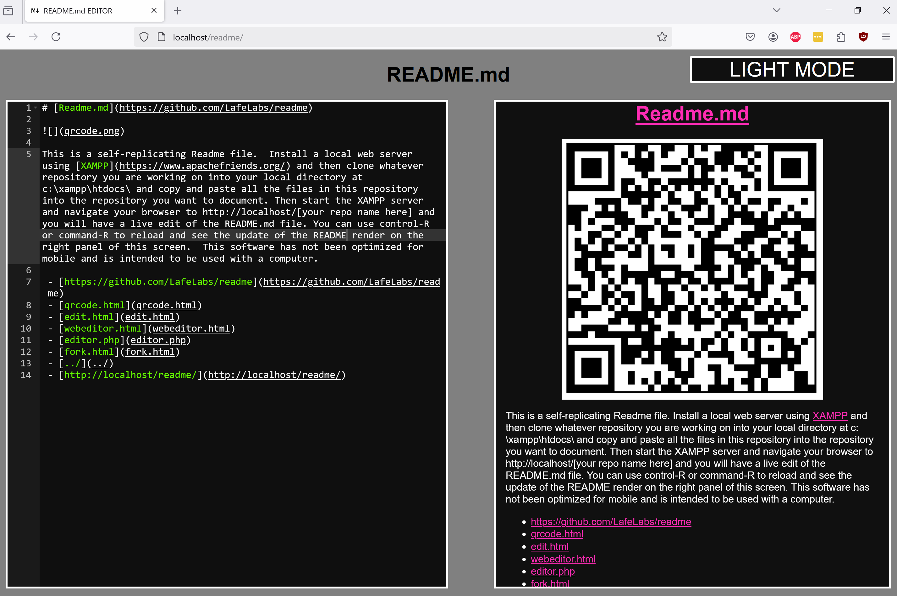
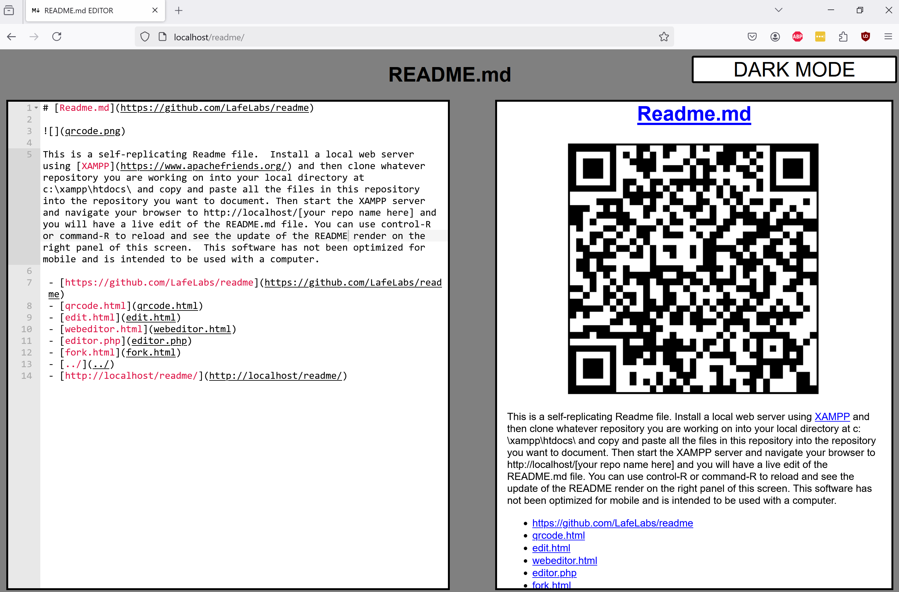

# [Readme.md](https://github.com/LafeLabs/readme)

This is a self-replicating Readme file.  Install a local web server using [XAMPP](https://www.apachefriends.org/) and then clone whatever repository you are working on into your local directory at c:\xampp\htdocs\ and copy and paste all the files in this repository into the repository you want to document. Then start the XAMPP server and navigate your browser to http://localhost/[your repo name here] and you will have a live edit of the README.md file. You can use control-R or command-R to reload and see the update of the README render on the right panel of this screen.  This software has not been optimized for mobile and is intended to be used with a computer.

 - [https://github.com/LafeLabs/readme](https://github.com/LafeLabs/readme)
 - [qrcode.html](qrcode.html)
 - [edit.html](edit.html)
 - [webeditor.html](webeditor.html)
 - [editor.php](editor.php)
 - [fork.html](fork.html)
 - [../](../)
 - [http://localhost/readme/](http://localhost/readme/)
 

